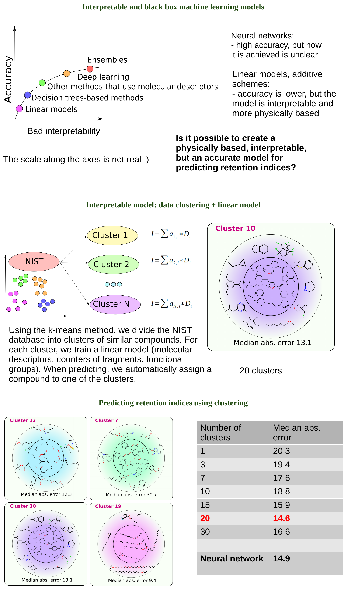

Prediction of gas chromatographic retention (models and data sets are not included) using a combination of clustering and regression models. The train set is subjected to k-means clustering, and for each cluster a model with automatic tuning of hyperparameters is trained. Work in progress.

The research is supported by Russian Science Foundation (project No. 22-73-10053)
